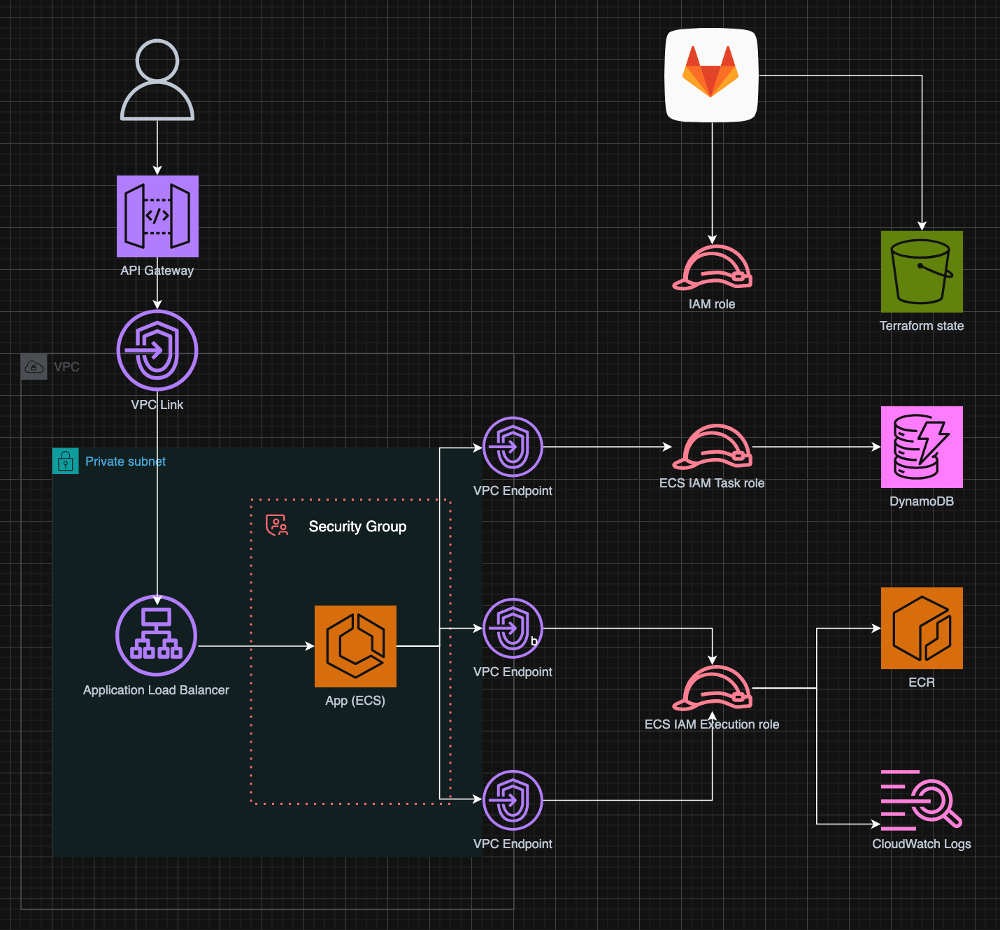

# Full Stack Cloud-Native Application

## Architecture Diagram

## 🏗 Architecture Overview

This application follows a "Private-First" architecture, ensuring that the compute and storage layers are never directly exposed to the public internet.

- **API Gateway (HTTP API):** Acts as the entry point with built-in rate-limiting and DDoS protection.
- **VPC Link:** A secure bridge that allows API Gateway to communicate with resources inside a private VPC.
- **ECS Fargate:** Scalable, serverless container orchestration. No "cold starts" and no execution time limits.
- **DynamoDB:** A NoSQL database chosen for its horizontal scalability and schema flexibility (ideal for evolving note structures).
- **VPC & PrivateLink:** The compute layer resides in private subnets with no public IPs. Communication with AWS services (S3, DynamoDB, ECR) is handled via VPC Endpoints to keep traffic secure via PrivateLink.

## 🔒 Security & Identity

- **OIDC Authentication:** GitLab CI/CD authenticates with AWS via OpenID Connect. No static IAM Access Keys are stored in GitLab.
- **Least Privilege:** ECS tasks use dedicated IAM Roles scoped specifically to the required DynamoDB table and CloudWatch Log Group.
- **Identity as the Perimeter:** Security is enforced via IAM policies and Security Groups, ensuring only the API Gateway can trigger the internal ALB.

## 🚀 Deployment Steps

### 1. Bootstrap Infrastructure (Manual First-Time Setup)

1.  Create an S3 bucket in your AWS account to store the Terraform state.
2.  Navigate to the `infra/` directory.
3.  Update `dev/uat/prd.tfvars` with your project-specific details.
4.  Run `terraform init` and `terraform apply` to create the ECR repository.

### 2. CI/CD Pipeline

Once the bootstrap is complete, the GitLab pipeline handles the rest:

1.  **Compliance:** Lints Terraform code and scans the application for security vulnerabilities.
2.  **Build:** Packages the Node.js app into a Docker image and pushes it to ECR.
3.  **Plan:** Generates an execution plan and passes it as an artifact.
4.  **Deploy (Manual):** Trigger the manual deployment stage in GitLab to apply the changes to AWS.

## ⚙️ Required CI/CD Variables

The following variables must be configured in **GitLab > Settings > CI/CD > Variables**:

| Variable Name  | Description                                                                        |
| :------------- | :--------------------------------------------------------------------------------- |
| `AWS_ROLE_ARN` | The ARN of the IAM Role created for GitLab CI OIDC.                                |
| `ECR_REGISTRY` | Your ECR Registry URI (e.g., `123456789012.dkr.ecr.ap-southeast-1.amazonaws.com`). |
| `AWS_REGION`   | The target AWS region (e.g.,`ap-southeast-1`).                                     |

_Note: `GITLAB_OIDC_TOKEN` is automatically generated by the pipeline for OIDC handshake._

## 🛠 Tech Stack

- **Language:** Node.js
- **Infrastructure:** Terraform
- **Cloud:** AWS (ECS, DynamoDB, VPC, API Gateway, etc.)
- **CI/CD:** GitLab CI
- **Containerization:** Docker
